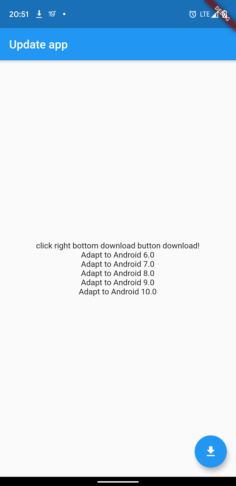

# [update_app](https://pub.dev/packages/update_app)
Update the app, pass in the updated address, and update the app.   
更新app, 传入更新的地址, 进行app更新    

The Android part is implemented using DownloadManager. If the file has been downloaded, install it directly.  
Android部分使用DownloadManager实现.若文件已下载, 则直接安装.    

The Ios section does not support external updates, skip the App Store.  
Ios部分不支持外部更新, 跳转App Store.

## Experience demo(体验Demo)
[download apk(下载APK)](apks/app-debug.apk)   



## How to use(如何使用)
```dart
import 'package:update_app/update_app.dart';

UpdateApp.updateApp(url: "apkPath",appleId:"375380948",title:"通知标题",description:"通知描述");
```


# Features(特点)
## Android part(Android部分)
1. Download using [DownloadManager](https://developer.android.com/reference/android/app/DownloadManager)  
   使用[DownloadManager](https://developer.android.com/reference/android/app/DownloadManager)进行下载
2. Monitor download completion broadcast  
   监听下载完成广播  
3. Adapt [Android 6.0 Runtime Permissions](https://developer.android.com/training/permissions/requesting?hl=en) Files are stored in the app directory, no need to apply for runtime permissions  
   适配[Android 6.0运行时权限](https://developer.android.com/training/permissions/requesting?hl=zh-cn) 文件存储在app目录, 不需要申请运行时权限
4. Adapt [Android 7.0FileProvider](https://developer.android.com/reference/android/support/v4/content/FileProvider)  
   适配[Android 7.0FileProvider](https://developer.android.com/reference/android/support/v4/content/FileProvider)
5. Adapt Android 8.0 installation permissions  
   适配Android 8.0安装权限
6. Adapt [Android 9.0 Network Security Configuration] (https://developer.android.com/training/articles/security-config)  
   适配[Android 9.0网络安全配置](https://developer.android.com/training/articles/security-config)

## IOS section(IOS部分)
1. Jump to the app store
   跳转应用商店